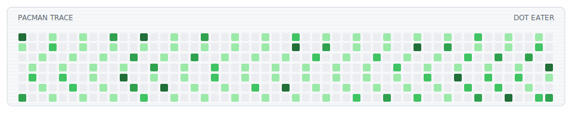

<h1 align="center">README Arcade</h1>

<p align="center">
  Animated arcade blocks for GitHub profile READMEs.
</p>

<p align="center">
  <a href="./README.ru.md">Russian mirror</a>
</p>

<p align="center">
  
  
  
  
  
</p>

<p align="center">
  <picture>
    <source media="(prefers-color-scheme: dark)" srcset="./dist/readme-arcade-dark.svg">
    <source media="(prefers-color-scheme: light)" srcset="./dist/readme-arcade.svg">
    
  </picture>
</p>

## What It Does

README Arcade generates animated SVG blocks for GitHub profile READMEs.

It is built around GitHub contribution-style grids: small cells, dark/light theme assets, deterministic motion, and optional contribution data from the GitHub API. The SVG repeats forever, so it keeps moving inside a README without JavaScript.

Available modes:

- `lifegrid`: Conway Game of Life, started from your GitHub login.
- `snake`: a short pink-headed snake starts after the login intro, eats the darkest cells first, and keeps moving without taking over the grid.
- `pacman`: a dot eater moving through a contribution-style field.

## Gallery

### Lifegrid

<p align="center">
  <picture>
    <source media="(prefers-color-scheme: dark)" srcset="./dist/gallery/lifegrid-dark.svg">
    <source media="(prefers-color-scheme: light)" srcset="./dist/gallery/lifegrid.svg">
    
  </picture>
</p>

### Snake

<p align="center">
  <picture>
    <source media="(prefers-color-scheme: dark)" srcset="./dist/gallery/snake-dark.svg">
    <source media="(prefers-color-scheme: light)" srcset="./dist/gallery/snake.svg">
    
  </picture>
</p>

### Pacman

<p align="center">
  <picture>
    <source media="(prefers-color-scheme: dark)" srcset="./dist/gallery/pacman-dark.svg">
    <source media="(prefers-color-scheme: light)" srcset="./dist/gallery/pacman.svg">
    
  </picture>
</p>

## Quick Start

Clone or fork this repository, then edit `readme-arcade.config.json`:

```json
{
  "user": "YOUR_LOGIN",
  "mode": "lifegrid"
}
```

Render the SVG files:

```bash
python scripts/render.py --config readme-arcade.config.json --out-dir dist
```

Put this in your profile README:

```html
<p align="center">
  <picture>
    <source media="(prefers-color-scheme: dark)" srcset="./dist/readme-arcade-dark.svg">
    <source media="(prefers-color-scheme: light)" srcset="./dist/readme-arcade.svg">
    
  </picture>
</p>
```

## Config

`mode` selects the animation.

`duration` controls how long one full animation loop takes. The SVG repeats forever.

`frames` controls how many precomputed states are embedded into that loop. More frames make the loop feel longer and less repetitive.

`holdFrames` controls how long the initial login mark stays visible before the selected mode starts moving.

For `snake`, `length` sets the starting body length, `maxLength` caps growth, and `growPerFood` controls how much the snake grows after eating a cell. Keep `growPerFood` at `0` for a clean runner that eats cells without getting long.

```json
{
  "user": "ECD5A",
  "mode": "lifegrid",
  "output": {
    "baseName": "readme-arcade"
  },
  "lifegrid": {
    "frames": 96,
    "duration": "42s",
    "holdFrames": 4,
    "density": "balanced",
    "activityStream": true,
    "titleLeft": "CONWAY LIFEGRID",
    "titleRight": "B3/S23"
  }
}
```

Render another mode:

```bash
python scripts/render.py --mode snake --base-name readme-arcade --out-dir dist
```

```bash
python scripts/render.py --mode pacman --base-name readme-arcade --out-dir dist
```

Timing presets:

```json
{ "frames": 72, "duration": "30s", "holdFrames": 3 }
```

```json
{ "frames": 120, "duration": "60s", "holdFrames": 5 }
```

## GitHub Actions

The included workflow renders the SVG:

- on push
- once per day
- manually from the Actions tab

Daily rendering lets the block pick up fresh GitHub contribution data when `GITHUB_TOKEN` is available.

## Roadmap

Possible future modes:

- `matrix`
- `hashwave`
- `boot`
- `space-invaders`

## Donate

If README Arcade is useful for your profile or project, you can support the author:

```text
TON: pointoncurve.ton
BTC: 1ECDSA1b4d5TcZHtqNpcxmY8pBH1GgHntN
USDT (TRC20): TSWcFVfqCp4WCXrUkkzdCkcLnhtFLNN3Ba
```

Donations are optional. Always verify the address and network before sending crypto.

## Disclaimer

README Arcade is provided as-is under the MIT License. Generated SVGs are decorative README assets; use them at your own risk. The project does not provide financial, security, or investment advice.

## License

MIT
