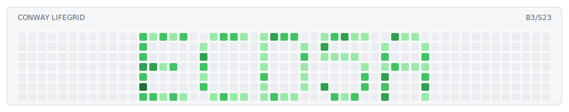
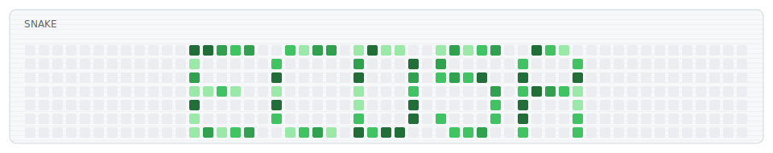
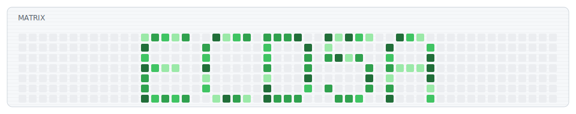
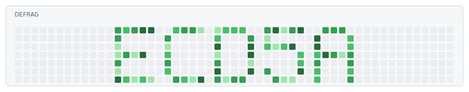

<h1 align="center">README Arcade</h1>

<p align="center">
  Animated GitHub contribution-grid arcade blocks for profile READMEs.
</p>

<p align="center">
  <a href="./README.ru.md">Русская версия</a>
</p>

<p align="center">
  
  
  
  
  
</p>

<p align="center">
  <picture>
    <source media="(prefers-color-scheme: dark)" srcset="./dist/readme-arcade-dark.svg">
    <source media="(prefers-color-scheme: light)" srcset="./dist/readme-arcade.svg">
    
  </picture>
</p>

## What Is This?

README Arcade generates animated SVG blocks that look like GitHub contribution grids, but behave like tiny retro screens.

It is made for profile READMEs:

- no JavaScript
- no package install
- dark and light SVG output
- deterministic animation from your GitHub login
- optional daily rebuild through GitHub Actions
- optional GitHub contribution data when `GITHUB_TOKEN` is available

The project stays in Python because it is the easiest path for forks: GitHub Actions already has it, Windows/macOS/Linux can run it, and there is no compiler or Node dependency chain to explain. C/C++ would be fun, but it would make setup heavier for most people.

## Modes

- `lifegrid`: Conway's Game of Life, seeded from your GitHub login.
- `snake`: a short snake and a faster worm appear from your login cells and eat GitHub-colored squares.
- `matrix`: code rain drops over the login intro and keeps a contribution-grid look.
- `defrag`: a Windows 98-style disk map that compacts fragmented cells.

## Gallery

### Lifegrid

<p align="center">
  <picture>
    <source media="(prefers-color-scheme: dark)" srcset="./dist/gallery/lifegrid-dark.svg">
    <source media="(prefers-color-scheme: light)" srcset="./dist/gallery/lifegrid.svg">
    
  </picture>
</p>

### Snake

<p align="center">
  <picture>
    <source media="(prefers-color-scheme: dark)" srcset="./dist/gallery/snake-dark.svg">
    <source media="(prefers-color-scheme: light)" srcset="./dist/gallery/snake.svg">
    
  </picture>
</p>

### Matrix

<p align="center">
  <picture>
    <source media="(prefers-color-scheme: dark)" srcset="./dist/gallery/matrix-dark.svg">
    <source media="(prefers-color-scheme: light)" srcset="./dist/gallery/matrix.svg">
    
  </picture>
</p>

### Defrag

<p align="center">
  <picture>
    <source media="(prefers-color-scheme: dark)" srcset="./dist/gallery/defrag-dark.svg">
    <source media="(prefers-color-scheme: light)" srcset="./dist/gallery/defrag.svg">
    
  </picture>
</p>

## Quick Start

Fork this repository and edit `readme-arcade.config.json`:

```json
{
  "user": "YOUR_LOGIN",
  "mode": "snake",
  "speed": "normal"
}
```

Commit the change. The included GitHub Action renders the SVG files into `dist/`.
If Actions are disabled in your fork, open the Actions tab and enable workflows once.

Use this in your GitHub profile README. Replace `YOUR_LOGIN` and `readme-arcade` if your fork has a different owner or repository name:

```html
<p align="center">
  <picture>
    <source media="(prefers-color-scheme: dark)" srcset="https://raw.githubusercontent.com/YOUR_LOGIN/readme-arcade/main/dist/readme-arcade-dark.svg">
    <source media="(prefers-color-scheme: light)" srcset="https://raw.githubusercontent.com/YOUR_LOGIN/readme-arcade/main/dist/readme-arcade.svg">
    
  </picture>
</p>
```

That is the whole basic setup.
The same snippet is also in `examples/profile-readme.md`.

## Config

Most users only need three fields:

```json
{
  "user": "YOUR_LOGIN",
  "mode": "lifegrid",
  "speed": "normal"
}
```

`mode` can be `lifegrid`, `snake`, `matrix`, or `defrag`.

`speed` can be `slow`, `normal`, `fast`, or `turbo`.

If you want deeper control, you can still override any mode block:

```json
{
  "user": "YOUR_LOGIN",
  "mode": "snake",
  "speed": "fast",
  "snake": {
    "duration": "24s",
    "frames": 120,
    "titleLeft": "SNAKE"
  }
}
```

Mode-specific `duration` wins over `speed`.

## Local Render

Render the selected mode:

```bash
python scripts/render.py --config readme-arcade.config.json --out-dir dist
```

Render another mode without editing the config:

```bash
python scripts/render.py --mode matrix --base-name readme-arcade --out-dir dist
```

Render the gallery:

```bash
python scripts/render_gallery.py
```

Open `preview/index.html` to view all modes locally.

## GitHub Actions

The workflow in `.github/workflows/render.yml` renders SVG files:

- on push
- once per day
- manually from the Actions tab

Daily rebuilds let contribution-based cells change over time.

## Support

If README Arcade helped your profile, tips are welcome:

```text
TON: pointoncurve.ton
BTC: 1ECDSA1b4d5TcZHtqNpcxmY8pBH1GgHntN
USDT (TRC20): TSWcFVfqCp4WCXrUkkzdCkcLnhtFLNN3Ba
```

## License

MIT
