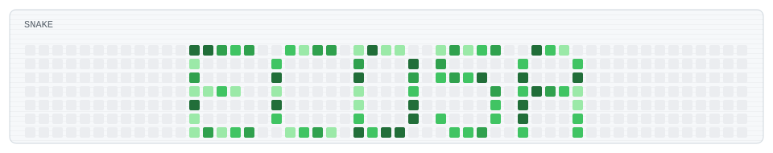
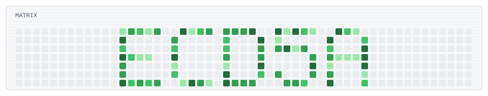
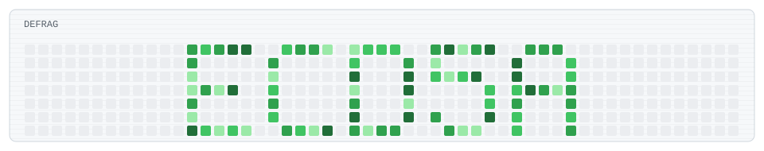
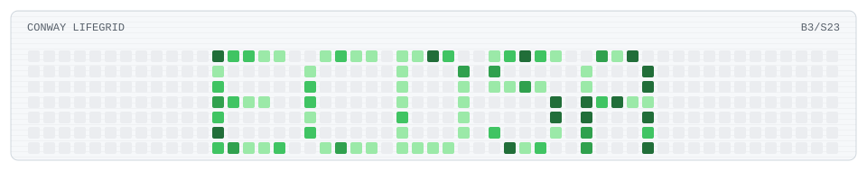

<h1 align="center">README Arcade</h1>

<p align="center">
  Turn your GitHub login into animated contribution-grid arcade art.
</p>

<p align="center">
  <a href="./README.ru.md">Русская версия</a>
</p>

<p align="center">
  
  
  
  
  
</p>

## Gallery

### Lifegrid

Conway's Game of Life starts from your GitHub login.

<p align="center">
  <picture>
    <source media="(prefers-color-scheme: dark)" srcset="./dist/gallery/lifegrid-dark.svg">
    <source media="(prefers-color-scheme: light)" srcset="./dist/gallery/lifegrid.svg">
    
  </picture>
</p>

### Snake

A snake and a fast worm appear from your login and eat GitHub-colored cells.
Their route changes with the daily render seed, and separation rules keep them
from spending most of the animation side by side.

<p align="center">
  <picture>
    <source media="(prefers-color-scheme: dark)" srcset="./dist/gallery/snake-dark.svg">
    <source media="(prefers-color-scheme: light)" srcset="./dist/gallery/snake.svg">
    
  </picture>
</p>

### Matrix

Code rain drops over your login.

<p align="center">
  <picture>
    <source media="(prefers-color-scheme: dark)" srcset="./dist/gallery/matrix-dark.svg">
    <source media="(prefers-color-scheme: light)" srcset="./dist/gallery/matrix.svg">
    
  </picture>
</p>

### Defrag

A Windows 98-style disk map compacts fragmented cells.

<p align="center">
  <picture>
    <source media="(prefers-color-scheme: dark)" srcset="./dist/gallery/defrag-dark.svg">
    <source media="(prefers-color-scheme: light)" srcset="./dist/gallery/defrag.svg">
    
  </picture>
</p>

## Quick Start

### Use the GitHub Action

Add `.github/workflows/readme-arcade.yml` to your profile repository or any
repository that will store the generated SVG files:

```yaml
name: README Arcade

on:
  workflow_dispatch:
  schedule:
    - cron: "17 3 * * *"

permissions:
  contents: write

jobs:
  render:
    runs-on: ubuntu-latest
    steps:
      - name: Checkout
        uses: actions/checkout@v7

      - name: Generate arcade SVG
        uses: ECD5A/README-Arcade@v1
        with:
          user: YOUR_LOGIN
          mode: snake
          speed: normal

      - name: Commit generated SVG
        run: |
          git config user.name "github-actions[bot]"
          git config user.email "41898282+github-actions[bot]@users.noreply.github.com"
          git add dist
          git diff --cached --quiet || git commit -m "Update README Arcade"
          git push
```

Replace `YOUR_LOGIN`, commit the workflow, and run it once from the Actions tab.
The Action writes `dist/readme-arcade.svg` and
`dist/readme-arcade-dark.svg` into your repository. The scheduled run refreshes
the contribution data daily. Snake routes use the current UTC date as their
default seed, so they also change daily.

Use `ECD5A/README-Arcade@v1` for compatible v1 updates or pin
`ECD5A/README-Arcade@v1.0.0` for an immutable setup.

#### Action inputs

| Input | Default | Description |
| --- | --- | --- |
| `user` | repository owner | GitHub login to render |
| `mode` | config or `lifegrid` | `lifegrid`, `snake`, `matrix`, or `defrag` |
| `speed` | config or `normal` | `slow`, `normal`, `fast`, or `turbo` |
| `config` | `readme-arcade.config.json` | Optional JSON config in your repository |
| `output-dir` | `dist` | Destination directory |
| `base-name` | config or `readme-arcade` | Output filename stem |
| `seed` | current UTC date | Deterministic animation seed |
| `github-token` | workflow token | Token used to read contributions |
| `python-version` | `3.13` | Python version used by the renderer |

The Action exposes `light-svg` and `dark-svg` outputs with the generated paths.
It generates files but deliberately leaves the commit policy to your workflow.

### Fork for full customization

Forking remains the best option when you want to change the renderer, create a
new mode, or maintain a deeply customized build.

1. Fork this repository.

2. Open `readme-arcade.config.json` and change three fields:

```json
{
  "user": "YOUR_LOGIN",
  "mode": "snake",
  "speed": "normal"
}
```

`user` is your GitHub login. `mode` is `lifegrid`, `snake`, `matrix`, or `defrag`. `speed` is `slow`, `normal`, `fast`, or `turbo`.

3. Commit the file. GitHub Actions will render SVG files into `dist/`.

If Actions are disabled in your fork, open the Actions tab, enable workflows, then run `render README Arcade` once.

The included workflow also runs once per day. A manual run can provide a custom
`seed`.

The default minimum distance between the snake and worm is three cells. It can
be adjusted in the configuration:

```json
{
  "snake": {
    "minActorDistance": 3
  }
}
```

4. Paste this into your profile README.

Your profile README is the `README.md` file inside the special repository named
`YOUR_LOGIN/YOUR_LOGIN`. When the workflow and README are in that same
repository, use relative paths:

```html
<p align="center">
  <picture>
    <source media="(prefers-color-scheme: dark)" srcset="./dist/readme-arcade-dark.svg">
    <source media="(prefers-color-scheme: light)" srcset="./dist/readme-arcade.svg">
    
  </picture>
</p>
```

If the generated files live in a separate repository or fork, replace each
relative path with its raw URL, for example
`https://raw.githubusercontent.com/YOUR_LOGIN/README-Arcade/main/dist/readme-arcade-dark.svg`.

The `<picture>` block lets GitHub choose the dark or light SVG automatically for
each visitor. The normal SVG is also the fallback for clients that do not
support theme detection.

See every mode running on the
[live GitHub Pages gallery](https://ecd5a.github.io/README-Arcade/).

## Local Preview

You do not need local setup if you use GitHub Actions. Local render is optional:

```bash
python scripts/render.py
python scripts/render_gallery.py
```

Use `python scripts/render.py --mode snake --seed demo` to preview a specific
route locally.

Open `preview/index.html` to view all modes.

## Contributing and Security

Contributions are welcome. Read [CONTRIBUTING.md](CONTRIBUTING.md) before
opening a pull request. Use the structured issue forms for reproducible bugs
and focused feature requests.

Do not disclose vulnerabilities in public issues. Follow
[SECURITY.md](SECURITY.md) to submit a private report through GitHub.

## Donate

If README Arcade helped your profile, tips are welcome:

```text
TON: pointoncurve.ton
BTC: 1ECDSA1b4d5TcZHtqNpcxmY8pBH1GgHntN
USDT (TRC20): TUF4vPdB6QkjCvZq18rBL4Qj4dK5ihCN75
```

## License

MIT
