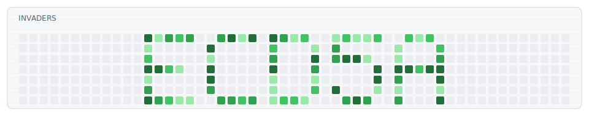

<h1 align="center">README Arcade</h1>

<p align="center">
  Анимированные arcade-блоки для GitHub profile README.
</p>

<p align="center">
  <a href="./README.md">English README</a>
</p>

<p align="center">
  
  
  
  
  
</p>

<p align="center">
  <picture>
    <source media="(prefers-color-scheme: dark)" srcset="./dist/readme-arcade-dark.svg">
    <source media="(prefers-color-scheme: light)" srcset="./dist/readme-arcade.svg">
    
  </picture>
</p>

## Что Это

README Arcade генерирует анимированные SVG-блоки для GitHub profile README.

Идея простая: маленькая arcade-анимация в стиле GitHub contribution grid. Блок умеет dark/light тему, не требует JavaScript, повторяется бесконечно и может брать contribution-данные через GitHub API.

Доступные режимы:

- `lifegrid`: Conway Game of Life, стартует из твоего GitHub-ника.
- `snake`: короткая змейка с розовой головой и быстрый червяк стартуют после интро с ником, сначала едят самые темные клетки и не забивают собой всю сетку.
- `invaders`: маленькая old-school стрелялка с пришельцами, кораблем, выстрелами, вспышками попаданий и тем же интро с ником.

## Галерея

### Lifegrid

<p align="center">
  <picture>
    <source media="(prefers-color-scheme: dark)" srcset="./dist/gallery/lifegrid-dark.svg">
    <source media="(prefers-color-scheme: light)" srcset="./dist/gallery/lifegrid.svg">
    
  </picture>
</p>

### Snake

<p align="center">
  <picture>
    <source media="(prefers-color-scheme: dark)" srcset="./dist/gallery/snake-dark.svg">
    <source media="(prefers-color-scheme: light)" srcset="./dist/gallery/snake.svg">
    
  </picture>
</p>

### Invaders

<p align="center">
  <picture>
    <source media="(prefers-color-scheme: dark)" srcset="./dist/gallery/invaders-dark.svg">
    <source media="(prefers-color-scheme: light)" srcset="./dist/gallery/invaders.svg">
    
  </picture>
</p>

## Быстрый Старт

Склонируй или форкни репозиторий, потом измени `readme-arcade.config.json`:

```json
{
  "user": "YOUR_LOGIN",
  "mode": "lifegrid"
}
```

Сгенерируй SVG:

```bash
python scripts/render.py --config readme-arcade.config.json --out-dir dist
```

Вставь в свой profile README:

```html
<p align="center">
  <picture>
    <source media="(prefers-color-scheme: dark)" srcset="./dist/readme-arcade-dark.svg">
    <source media="(prefers-color-scheme: light)" srcset="./dist/readme-arcade.svg">
    
  </picture>
</p>
```

## Конфиг

`mode` выбирает анимацию.

`duration` задает длительность одного полного цикла. SVG повторяется бесконечно.

`frames` задает количество заранее рассчитанных кадров внутри цикла. Чем больше кадров, тем длиннее и менее повторяющейся ощущается анимация.

`holdFrames` задает паузу на первом кадре, чтобы ник успели увидеть до старта выбранного режима.

Для `snake` параметр `length` задает длину основной змейки, `maxLength` ограничивает рост, а `growPerFood` задает, насколько змейка растет после съеденной клетки. Значение `0` оставляет ее короткой: она ест клетки, но почти не растет. Быстрый червяк настраивается через `worm`, `wormLength`, `wormSpeed` и `wormGrowPerFood`.

```json
{
  "user": "ECD5A",
  "mode": "lifegrid",
  "output": {
    "baseName": "readme-arcade"
  },
  "lifegrid": {
    "frames": 96,
    "duration": "42s",
    "holdFrames": 4,
    "density": "balanced",
    "activityStream": true,
    "titleLeft": "CONWAY LIFEGRID",
    "titleRight": "B3/S23"
  }
}
```

Другой режим:

```bash
python scripts/render.py --mode snake --base-name readme-arcade --out-dir dist
```

```bash
python scripts/render.py --mode invaders --base-name readme-arcade --out-dir dist
```

Пресеты времени:

```json
{ "frames": 72, "duration": "30s", "holdFrames": 3 }
```

```json
{ "frames": 120, "duration": "60s", "holdFrames": 5 }
```

## GitHub Actions

Workflow уже есть. Он генерирует SVG:

- при push
- раз в день
- вручную через вкладку Actions

Ежедневная генерация нужна, чтобы блок мог подхватывать свежие GitHub contribution-данные.

## Roadmap

Идеи для следующих режимов:

- `matrix`
- `hashwave`
- `boot`
- `arkanoid`

## Donate

Если README Arcade пригодился для твоего профиля или проекта, можно поддержать автора:

```text
TON: pointoncurve.ton
BTC: 1ECDSA1b4d5TcZHtqNpcxmY8pBH1GgHntN
USDT (TRC20): TSWcFVfqCp4WCXrUkkzdCkcLnhtFLNN3Ba
```

Донаты добровольные. Перед отправкой всегда проверяй адрес и сеть.

## Disclaimer

README Arcade предоставляется как есть по лицензии MIT. Сгенерированные SVG являются декоративными README-ассетами; используй их на свой риск. Проект не является финансовой, инвестиционной или security-рекомендацией.

## Лицензия

MIT
